# [PL] Projekt Zespołowy

## Model Kolaboracji

- Każda aktywność związana z rozwojem dowolnego komponentu aplikacji powinna być pokryta przez stworzenie zadania, tj. pierwszy krok przy przystąpieniu do pracy nad dowolną funkcjonalnością powinien polegać na stworzeniu i przypisaniu do siebie zadania
- Do zarządzania zadaniamy wykorzystujemy funkcjonalność serwisu GitHub - Issues

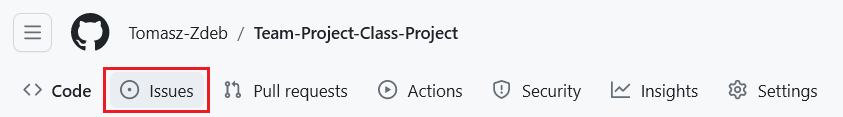

- Zadania definiujemy według ścisłego formatu:

    - Nazwa zadania zaczyna się od wielkiej litery pozostałe słowa pisane są małą literą niezależnie czy to nazwy własne czy nie
    - Spacje w nazwie zadania są zastąpione myślnikami
    - W nazwie zadania nie używamy polskich znaków (wyjaśnienie dlaczego, przy sekcji dotyczącej -branchingu*)
    - Opis zadania zawiera kryteria akceptacj czyli stwierdzenia opisujące stan po realizacji zadania na które można odpowiedzieć: **prawda** lub **fałsz** wg. formy przedstawionej na zrzucie ekranu (nagłówek drugiego poziomu i checkboxy), które w miarę realizacji zadania oznacza się jako zrealizowane

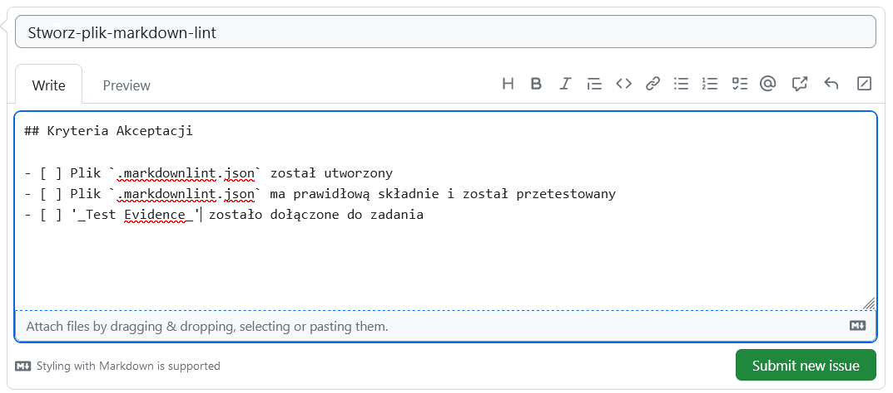

- Zadanie może zawierać sekcję z dodatkowymi informacjami:

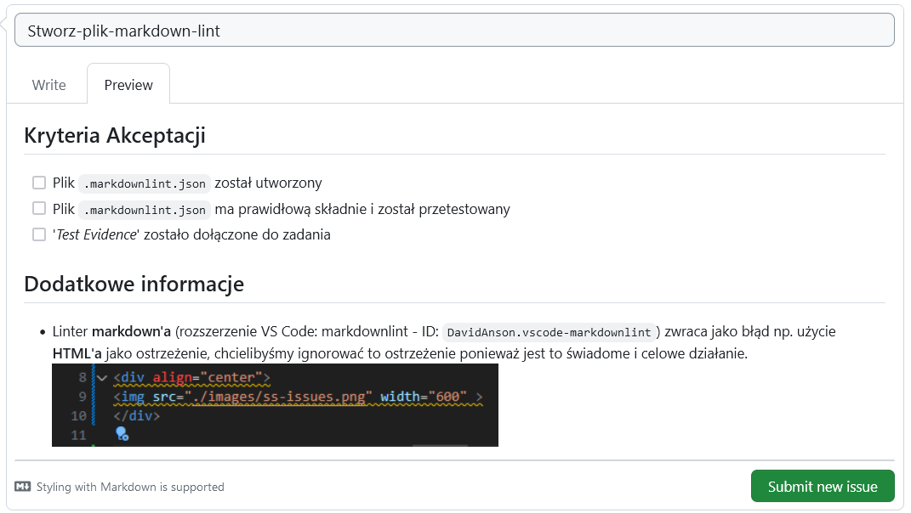

- Każde zadanie w momencie tworzenia powinno mieć przypisany tag z numerem sprintu w którym zostało utworzone i informacjami dotyczącymi charatkeru zadania (np. frontend)

- Do zadania można się przypisać od razu w momencie tworzenia, nie jest to jednak konieczne. Czasami definiujemy zadania którymi zajmie się ktoś inny. Zadanie można przypisać do kilku osób jeżeli są w nie zaangażowane (np. gdy sprawdzenie funcjonalności wymaga zaangażowania ze strony teamu frontendowego i backendowego)

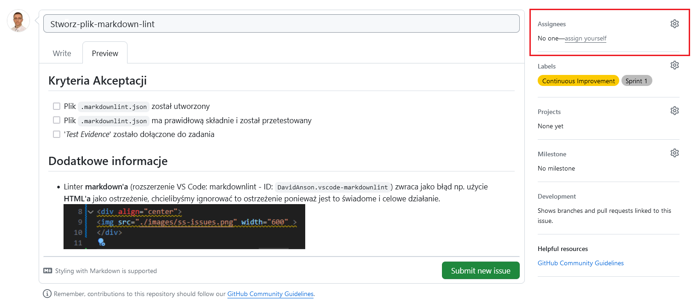

- Nie będziemy wykorzystywać funkcjonalności: '*kamieni milowych*' tj. śledzenie długoterminowych celów/istotnych faz realizacji projektu, ze względu na długośc trwania projektu i niejednorodnośc w czasie pracy

- Zakładka: '*Development*' będzie przydatna, ale dopiero po utworzeniu zadania

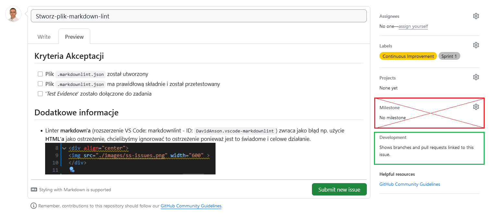

### Zarządzanie Gałęziami (Branching Strategy)

- Po stworzeniu zadania, w widoku zadania w zadkładce: '*Development*' pojawia się opcja: '***Create Branch***', której należy używać do tworzenia nowych gałęzi systemu kontroli wersji

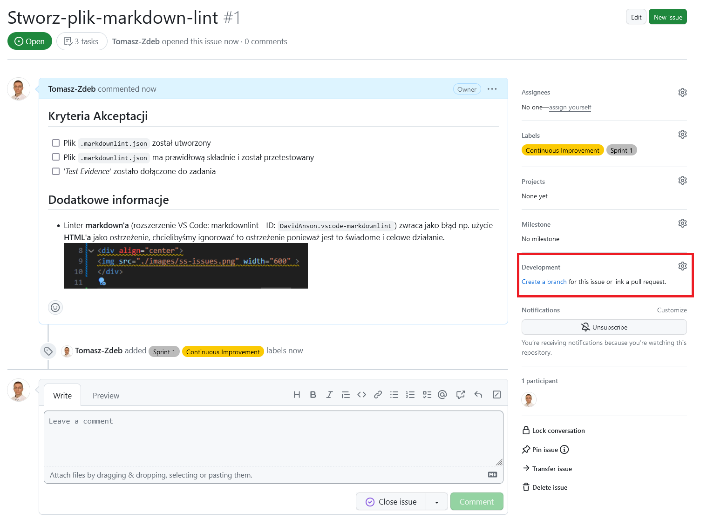

- Pozostawiamy domyślną nazwę gałęzi (stąd też zasadny nazewnictwa zadań były ścisłe)

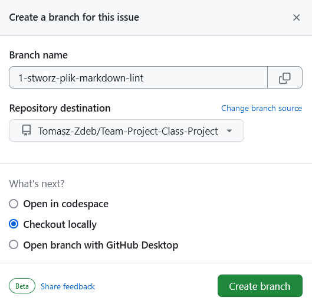

- Tak stworzone gałęzie będą z automatu kojarzone przez GitHub z danym zadaniem, niestety to samo nie dotyczy Pull Requestów i je trzeba będzie łączyć ręcznie

- Czasami gdy GIT nie widzi zmian w postaci nowej gałęzi która została utworzona w zdalnym repozytorium można skorzystać z komendy: `git remote update origin --prune` która odświeży informacje na temat gałęzi w zdalnym repozytorium.

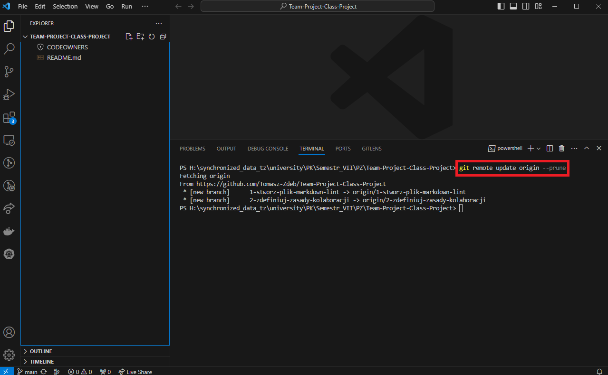

### Commit'y

- Wszelkie commity ze zmianami umieszczamy na gałęzi dotyczącej danego zadania

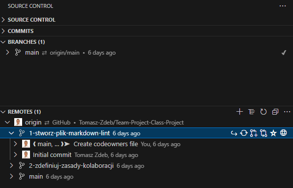

- Zmiany dzielimy na poszczególne *commity* albo ujmujemy w jednym *commicie* - tą decyzję musi podjąć osoba pracująca nad zadaniem. Dla małych zmian jeden *commit* jest wystarczający.

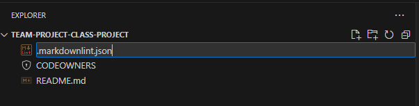

- Format wiadomości w commicie w Języku Polskim
    - Tryb rozkazujący
    - Pierwsze słowo rozpoczęte wielką literą
    - Pozostałe słowa wyłącznie małymi literami niezależnie od tego czy są to nazwy własne
    - Słowa oddzielone jedną spacją
    - Bez kropki i spacji na końcu wiadomości

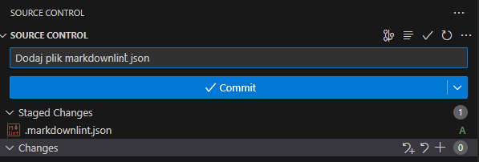

- Po zakończeniu pracy nad funkcjonalnością (i jej przetestowaniu) zmiany należy wypchnąć do zdalnego repozytorium. Kompletny zestaw zmian kwalifikujących się do włączenia do głównej gałęzi repozytorium powinien oprócz samego kodu danej funkcjonalności zawierać:

    - Testy jednostkowe pokrywające wprowadzaną funkcjonalności
    - Dokumentacje Techniczną wprowadzanej funkcjonalności

### Pull Request i Code Review

- Po wypchnięciu zmian, na [głównej stronie repozytorium](https://github.com/Tomasz-Zdeb/Team-Project-Class-Project) pojawi się komunikat o niedawno wprowadzonych zmianach. Jeżeli to nie nastąpi, do tworzenia Pull Requesta można przejść z widoku gałęzi. Pull requesta tworzymy po to aby zawnioskować o przyłączenie zmian z danej gałęzi go gałęzi głównej, na której to powinien znajdować się jedynie działający, stabilny kod.

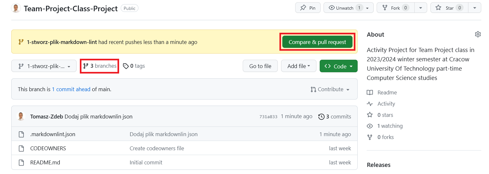

- Nazwę *Pull Requesta* należy pozostawić domyślną, odpowiadać będzie ona nazwie zadania
- Aby powiązać *PR* z danym zadaniem należy dodać jedno ze słów kluczowych, np. `closes` wraz z numerem zadania, który powinien znajdować się w nazwie gałęzi jeżeli zastosowane były wcześniejsze wytyczne.
- Pozostałe pola pozostawiamy bez wartości

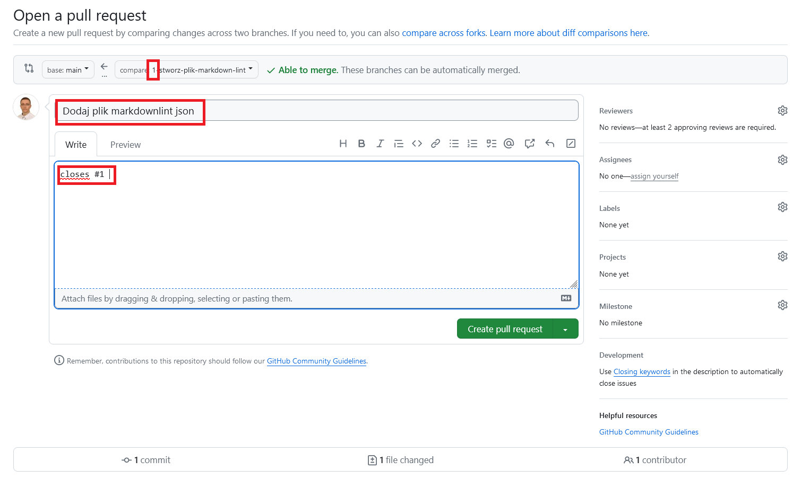

- Po utworzeniu *Pull Requesta* widoczny jest komunikat o tym, że wcelu właczenia zmian do głównej gałęzi repozytorium potrzebne są *Code Review* od dwóch osób, z czego jedna z nich to właściel repozytorium.
- *Code Review* można dokonać w zakładce *PR* zawierającej zmienione pliki. *Code Review* to proces polegający na sprawdzeniu zmian pod kątem literówek i niespójności które osoba pracująca nad zadaniem mogła przeoczyć. Serwis Git-Hub pozwala na dodawanie komentarzy powiązanych z konkretną linią danego pliku. Wszelkie niejasności powinny zostać wyjaśnione przez zaakceptowanie zmian w procesie *Code Review*.
- Po zdobyciu dwóch zgód, przycisk pozwalający na połączenie zmian z główną gałęzią staje się dostępny.

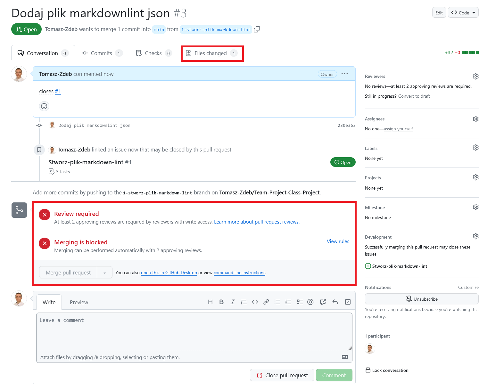

- Dzięki użyciu zamykającego słowa kluczowego, po połączeniu *Pull Requesta* z główną gałęzią zadanie zostanie automatycznie zamknięte

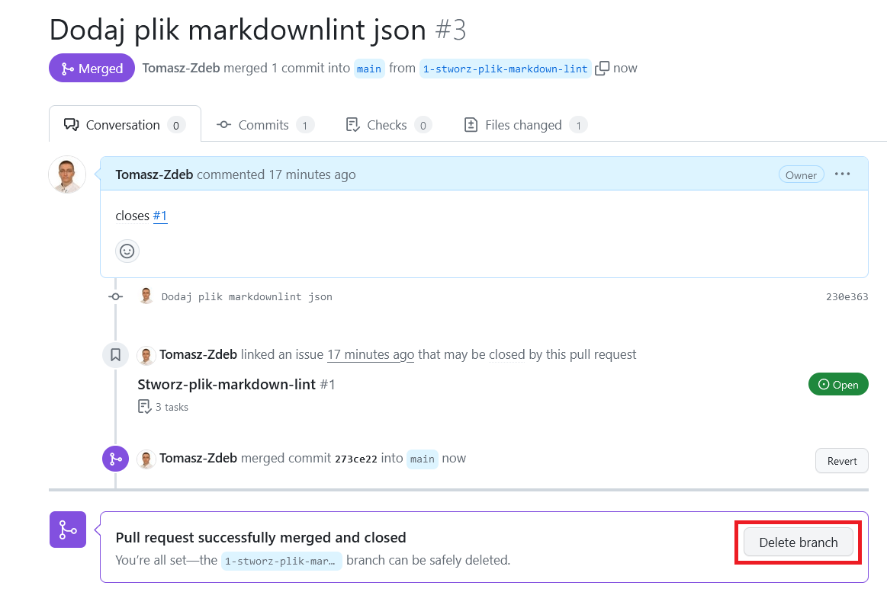

- Proszę pamiętać o zaznaczeniu wszystkich checkboxów w kryteriach akceptacji zadania 😉

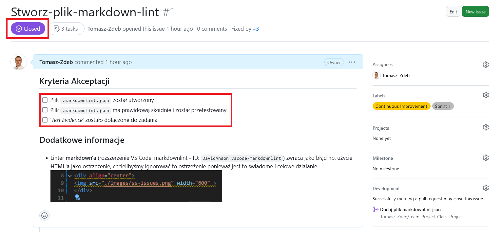

- (Dodatkowa informacja) - Opcja: *Merge Commit* została wyłączona w repozytorium, dlaczego?

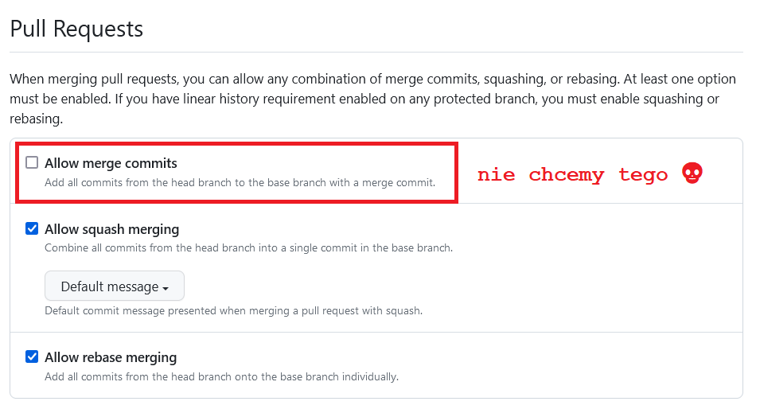

Dlatego aby uniknąć dodatkowych *commitów* mówiących jedynie o tym, że w danym momencie nastąpiło połączenie zmian z gałęzi roboczej z gałęzią główną

## Dokumentacja Techniczna

Na razie pusto 😉

